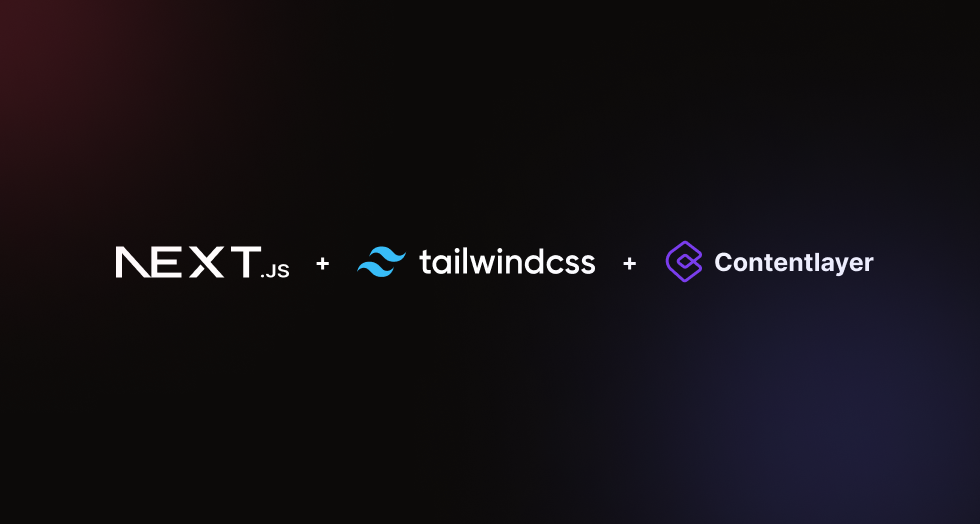

<div align="center">
  
  <h1>My Dev Blog </h1>
</div>
<p align="center">My Dev blog powered by Nextjs, Tailwind, ContentLayer</p>
<br/>

## Motive

I always wanted a DEV blog where I can post my thoughts and workflows. Decided to build my blog and tried with various tech stacks and finally landed upon current framework.

## Template Used

[schardev/nextjs-contentlayer-blog](https://github.com/schardev/nextjs-contentlayer-blog) - This is the template I used here which met all my requirements. Mobile friendly, SEO friendly, easy to use, modern, readable and customize.

## Theme

The template comes with a default theme based on **Stone** color palette from Tailwind CSS. But don't worry, you have the freedom to create your own theme by customising and tweaking `config.css`.

## Getting Started

1. Clone the starter template:

```bash
git clone https://github.com/schardev/nextjs-contentlayer-blog

# or using `gh`
gh repo clone schardev/nextjs-contentlayer-blog
```

2. Add site information and relevant data to `lib/siteConfig.ts`.
3. Add your blog posts to `content/blog` directory with proper front-matter (see available fields [here](https://github.com/schardev/nextjs-contentlayer-blog/blob/main/schema/contentlayer/blog-post.ts))
4. Build your blog with:

```bash
pnpm build
```

5. Deploy to your hosting provider 🎉

Starting a development server isn't different either, just run:

```bash
pnpm dev
```

Now open `http://localhost:3000` to view changes to your blog as it happens.

## Directory and File Structure

| Directory/File           | Notes                                                                                                           |
| ------------------------ | --------------------------------------------------------------------------------------------------------------- |
| `app/`                   | Defines your site/blog's routes                                                                                 |
| `components/`            | All react component code lives here                                                                             |
| `content/`               | Directory where your MDX or Markdown file lives                                                                 |
| `public/`                | Static assets goes here (e.g., put all your images inside `public/images` and fonts inside `public/fonts` etc)  |
| `styles/`                | Find all styling files here                                                                                     |
| `schema/`                | Contains schema-related files                                                                                   |
| `contentlayer.config.ts` | [Contentlayer](https://www.contentlayer.dev/) configuration file (you can change your `content` directory here) |
| `lib/siteConfig.ts`      | Holds config related to the site itself                                                                         |

## Additional notes

- If you have worked with [`next/image`](https://nextjs.org/docs/app/api-reference/components/image) before you know that working with external images is a pain in the ass, as you have to manually inspect and pass width and height properties to the `<Image/>` component. Sure you can use `fill` property but then you have to have a fixed aspect ratio and/or deal with z-indexes. However, working with external images is now a breeze. Use the custom `<Image/>` component from the `components/` directory that takes care of all of it. No more manual width and height hassles, as image optimizations are automatically handled.

- Additionally, code blocks support everything [`rehype-pretty-code`](https://rehype-pretty-code.netlify.app/) supports. You even get the bonus of file type icons! You can also extend or customize the default file type icons from [here](https://github.com/schardev/nextjs-contentlayer-blog/blob/main/components/brand-icon.tsx).

- As mentioned already, styling is mostly controlled via CSS variables so it's pretty easy to tweak and configure. See [`config.css`](https://github.com/schardev/nextjs-contentlayer-blog/blob/main/styles/config.css).

> **Note**:
>
> Image optimisations using custom `<Image/>` component only works if your blog is statically generated. **Do not use it as a client or server component.**

If you encounter any issues or have any feature requests, feel free to report them in the [main repository](https://github.com/schardev/nextjs-contentlayer-blog/tree/main).

## Inspirations

- [Tailwind Nextjs Starter Blog](https://github.com/timlrx/tailwind-nextjs-starter-blog)
- [Stackoverflow Blog](https://stackoverflow.blog/)
- [Material UI Blog](https://mui.com/blog/)
- [Web Bulletin](https://web-bulletin.vercel.app/)

## Licence

MIT © [Saurabh Charde](https://schar.dev)

Feel free to use this in whatever projects you like. Make sure to star the [repo](https://github.com/schardev/nextjs-contentlayer-blog) if you like it.
